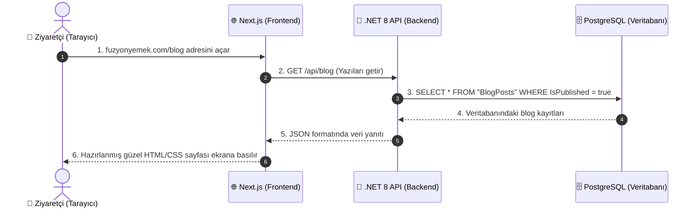

# 🎓 Füzyon Yemek — Yazılım Geliştirme & Mimari Eğitim Kılavuzu

Merhaba sevgili genç yazılımcı adayı! 👋 

Bu rehber, **Füzyon Yemek** projesini incelerken modern bir web uygulamasının nasıl tasarlandığını, hangi teknolojilerin neden seçildiğini ve endüstri standardı bir projenin arkasındaki düşünce yapısını adım adım kavramanı sağlamak için hazırlandı.

---

## 📌 İçindekiler
1. [Bölüm 1: Büyük Resim — Bir Web Uygulaması Nasıl Çalışır?](#bölüm-1-büyük-resim--bir-web-uygulaması-nasıl-çalışır)
2. [Bölüm 2: Neden Bu Teknolojileri Seçtik?](#bölüm-2-neden-bu-teknolojileri-seçtik)
3. [Bölüm 3: Projenin 3 Ana Katmanı ve Kod Turu](#bölüm-3-projenin-3-ana-katmanı-ve-kod-turu)
4. [Bölüm 4: Vaka Çalışması — Sıfırdan Yeni Bir Özellik Nasıl Eklenir?](#bölüm-4-vaka-çalışması--sıfırdan-yeni-bir-özellik-nasıl-eklenir)
5. [Bölüm 5: Genç Yazılımcılara Altın Değerinde Tavsiyeler](#bölüm-5-genç-yazılımcılara-altın-değerinde-tavsiyeler)

---

## Bölüm 1: Büyük Resim — Bir Web Uygulaması Nasıl Çalışır?

Bir web uygulaması aslında bir **Restorana** çok benzer:

| Gerçek Hayat (Restoran) | Yazılım Dünyası | Bu Projedeki Karşılığı |
| :--- | :--- | :--- |
| **Müşteri Masası & Menü** | **Frontend (Ön Yüz)** | `src/` (Next.js Vitrin Sitesi) |
| **Garson (Siparişi Taşıyan)** | **HTTP İstekleri / REST API** | `src/lib/api.ts` & `BlogController.cs` |
| **Mutfak & Şefler (Yemeği Hazırlayan)** | **Backend (Sunucu / İş Mantığı)**| `api/` (.NET 8 Web API) |
| **Kiler / Depo (Malzemelerin Saklandığı Yer)** | **Database (Veritabanı)** | PostgreSQL (Neon.tech) |
| **Müdür Odası (Stok ve Fiyatları Yöneten)** | **Admin Paneli** | `admin/` (Vite + React SPA) |

---

## Bölüm 2: Neden Bu Teknolojileri Seçtik?

Bir yazılımcının en büyük gücü sadece kod yazmak değil, **"Hangi iş için hangi aleti seçeceğini"** bilmektir.

### 1. Neden Vitrin Sitesinde Next.js (App Router) Kullandık?
- **Google SEO Gücü:** Sıradan bir React uygulamasında sayfa kaynağını görüntülerseniz içi boştur (boş bir `

`). Google robotları boş sayfayı sevmez. Next.js sayfayı sunucuda oluşturup (Server-Side Rendering) Google'a hazır metin gönderir.
- **Işık Hızında Açılış:** Ziyaretçinin bilgisayarı JavaScript çalıştırmakla uğraşmaz, anında sayfa açılır.

### 2. Neden Admin Panelinde Vite + React Kullandık?
- Admin paneli Google'da çıkmak zorunda değildir (şifreli özel alandır). Bu yüzden SEO'ya ihtiyaç yoktur.
- Vite + React, tek bir sayfa gibi çalışan (Single Page Application) anlık ve son derece akıcı bir yönetim deneyimi sunar.

### 3. Neden Backend'de .NET 8 (C#) Kullandık?
- **Yüksek Hız ve Tip Güvenliği:** C#, dünyanın en hızlı ve en güvenli dillerinden biridir. Milyonlarca isteği çok az bellek harcayarak karşılayabilir.
- **Clean Architecture (Temiz Mimari):** Kodlarımızı mantıksal katmanlara (Domain, Application, Infrastructure, API) bölerek projenin yıllar sonra bile çöp olmadan geliştirilebilmesini sağlar.

### 4. Neden PostgreSQL Veritabanı?
- İlişkisel verileri (Kategoriler, Bloglar, Kullanıcılar, Roller) birbirine güvenle bağlar (Foreign Key). Veri kaybını önleyen ACID standartlarına tam uyumludur.

---

## Bölüm 3: Projenin 3 Ana Katmanı ve Kod Turu

### 🌐 Katman 1: Frontend (`src/`)
- **`src/app/layout.tsx`**: Tüm sayfaların dış iskeletidir. Üst menü (Navbar) ve alt menü (Footer) burada sabit durur.
- **`src/app/page.tsx`**: Ana sayfadır. Next.js Server Component olarak çalışır; API'den verileri çeker, API kapalıysa bile yedek (Fallback) verilerle sayfanın çökmesini engeller.
- **`src/app/blog/[slug]/page.tsx`**: Köşeli parantez `[slug]` dinamik sayfadır. `/blog/saglikli-beslenme` veya `/blog/ozon-nedir` adresine göre veritabanından doğru yazıyı bulup ekrana basar.
- **`src/components/UI/`**: Buton, kart, başlık gibi tekrar eden parçaları bağımsız bileşenler olarak tutarız.

### ⚙️ Katman 2: Admin Paneli (`admin/`)
- **`admin/src/contexts/AuthContext.tsx`**: Giriş yapan yöneticinin bilgilerini hafızada tutan Global Durum (State) merkezidir.
- **`admin/src/services/api.ts`**: Axios Interceptor kullanarak her isteğin arkasına otomatik JWT Token yapıştırır. Token'ın süresi dolunca sessizce yeniler.
- **`admin/src/pages/BlogEditor.tsx`**: Yeni blog yazısı ekleme ve zengin metin düzenleme sayfasıdır.

### 🚀 Katman 3: Backend API (`api/`)
- **`FuzyonYemek.Domain`**: Varlıklar (BlogPost, User, Service). Veritabanı tablolarının C# sınıflarıdır.
- **`FuzyonYemek.Infrastructure`**: PostgreSQL ile bağlantı kuran Entity Framework Core katmanıdır.
- **`FuzyonYemek.API/Controllers`**: Tarayıcıdan gelen HTTP isteklerini karşılayan uç noktalardır.
- **`FuzyonYemek.API/Program.cs`**: Sunucunun başlangıç ayarları, güvenlik (CORS & JWT) ve Middleware boru hattıdır.

---

## Bölüm 4: Vaka Çalışması — Sıfırdan Yeni Bir Özellik Nasıl Eklenir?

Diyelim ki patron sizden **"Müşteri Yorumları (Testimonials)"** modülü eklemenizi istedi. Sırasıyla hangi adımları izlemelisiniz?

1. **Adım 1 (Veritabanı Varlığı):** `api/src/FuzyonYemek.Domain/Entities/Testimonial.cs` dosyasını oluştur (Ad Soyad, Şirket, Yorum Metni, Puan, AktifMi).
2. **Adım 2 (Veritabanı Tablosu):** `Infrastructure/Data/AppDbContext.cs` içine `public DbSet<Testimonial> Testimonials { get; set; }` ekle.
3. **Adım 3 (API Endpoint):** `Controllers/TestimonialsController.cs` oluştur (`[HttpGet]` ve `[HttpPost]` metotlarını yaz).
4. **Adım 4 (Frontend API İstemcisi):** `src/lib/api.ts` içine `getTestimonials()` fonksiyonunu ekle.
5. **Adım 5 (Arayüzde Gösterim):** `src/app/page.tsx` veya yeni bir bileşende gelen yorumları kartlar halinde listele.

Gördüğünüz gibi katmanlı mimaride her şeyin yeri bellidir. Birbirine karışmaz!

---

## Bölüm 5: Genç Yazılımcılara Altın Değerinde Tavsiyeler

1. **Kodları Ezberleme, Mantığını Anla:** `useState`, `useEffect` veya `async/await` gibi kavramların syntax'ını ezberlemene gerek yok. "Neden burada `useEffect` kullanıyorum?" sorusunun cevabını bilmen yeterli.
2. **Hatalardan Korkma:** En kıdemli yazılımcı bile günde onlarca hata mesajı alır. Hata mesajı sana neyin yanlış olduğunu söyleyen bir rehberdir; mesajı dikkatlice oku.
3. **Temiz ve Anlaşılır Kod Yaz (Clean Code):** Değişkenlerine `a`, `b`, `temp1` gibi anlamsız isimler verme. `isPublished`, `userEmail`, `totalCount` gibi okuyan herkesin anlayacağı isimler seç.
4. **Git ve GitHub'ı İyi Öğren:** Kodlarını düzenli olarak anlamlı commit mesajlarıyla GitHub'a yükle. GitHub senin en büyük özgeçmişindir!

Başarılar dileriz! 🚀 Kodlamaya ve üretmeye devam et!
