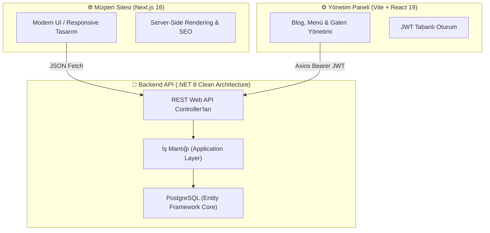

# 🍽️ Füzyon Yemek — Kurumsal Web Sitesi & Yönetim Sistemi

[](https://nextjs.org/)
[](https://react.dev/)
[](https://dotnet.microsoft.com/)
[](https://www.postgresql.org/)
[](https://www.typescriptlang.org/)

> **Füzyon Yemek**, İstanbul genelinde kurumsal firmalara, fabrikalara, okullara ve hastanelere **ozon teknolojisi ve sıfır hata toleransı** ile hijyenik yemek üretimi ve catering hizmeti sunan modern bir gastronomi kuruluşudur.

Bu depo; kurumsal vitrin sitesi (Frontend), yöneticiler için içerik yönetim paneli (Admin) ve güvenli RESTful arka yüz servislerini (.NET 8 Web API) içeren **Full-Stack Monorepo** projesidir.

---

## 🧭 Proje Mimarisi

Sistem birbirini tamamlayan 3 ana katmandan oluşur:



---

## 📂 Dizin Yapısı ve Görevleri

```text
fuzyonyemek/
├── src/                  # 🌐 Next.js Frontend (Vitrin Sitesi)
│   ├── app/              # App Router Sayfaları (Hakkımızda, Blog, Galeri, Hizmetler vs.)
│   ├── components/       # Tekrar kullanılabilir UI bileşenleri (Navbar, Footer, Button, Card)
│   └── lib/              # API İstemcisi ve genel veri tipleri (api.ts)
│
├── admin/                # ⚙️ Vite + React Admin Paneli (İçerik Yönetim Sistemi)
│   ├── src/pages/        # Dashboard, BlogEditörü, Galeri ve Ayar sayfaları
│   ├── src/contexts/     # Global Authentication State (AuthContext.tsx)
│   └── src/services/     # Axios Interceptor ile otomatik JWT ve Token Refresh (api.ts)
│
├── api/                  # 🚀 .NET 8 Web API (Clean Architecture Backend)
│   ├── src/FuzyonYemek.API/            # HTTP Uç Noktaları, Middleware & Program.cs
│   ├── src/FuzyonYemek.Application/    # Servis Arayüzleri, DTO'lar & İş Mantığı
│   ├── src/FuzyonYemek.Domain/         # Veritabanı Varlıkları (Entities & Value Objects)
│   └── src/FuzyonYemek.Infrastructure/ # Entity Framework Core, PostgreSQL & JWT Servisleri
│
├── public/               # 🖼️ Statik medya dosyaları (Logolar, Sertifikalar, Görseller)
├── PROJE_REHBERI.md      # 🎓 Öğrenciler ve Yeni Başlayanlar İçin Detaylı Mimari Kılavuzu
└── DEPLOYMENT.md         # ☁️ Google Cloud Run & Canlıya Alma Rehberi
```

---

## 🚀 Hızlı Başlangıç (Projeyi Bilgisayarında Çalıştırma)

Projeyi yerel geliştirme ortamında çalıştırmak için aşağıdaki adımları sırasıyla uygulayabilirsiniz:

### 1. Gereksinimler
- [Node.js](https://nodejs.org/) (v18 veya üstü)
- [.NET 8 SDK](https://dotnet.microsoft.com/download/dotnet/8.0)
- [Git](https://git-scm.com/)

---

### 2. Adım Adım Çalıştırma

#### 🔹 1. Backend API'yi Başlatın (.NET 8)
```bash
cd api/src/FuzyonYemek.API
dotnet run
```
*API servisi `http://localhost:5050` adresinde çalışmaya başlayacaktır.*

#### 🔹 2. Frontend Vitrin Sitesini Başlatın (Next.js)
```bash
# Kök dizinde:
npm install
npm run dev
```
*Web sitesi `http://localhost:3000` adresinde açılacaktır.*

#### 🔹 3. Admin Panelini Başlatın (Vite + React)
```bash
cd admin
npm install
npm run dev
```
*Admin paneli `http://localhost:5173` adresinde açılacaktır.*

---

## 🎓 Öğrenci ve Yeni Başlayanlar İçin Eğitim Rehberi

Eğer yazılıma yeni başladıysanız veya bu projenin arkasındaki mimari kararları ("Neden Next.js seçildi?", "Clean Architecture nedir?", "JWT ile güvenlik nasıl sağlanır?") öğrenmek istiyorsanız:

👉 **[PROJE_REHBERI.md](PROJE_REHBERI.md)** belgemizi mutlaka okuyun!

---

## 📄 Lisans
Bu proje özel mülkiyete aittir. © 2026 Füzyon Yemek Üretim Gıda San. İç ve Dış Tic. Ltd. Şti. Tüm hakları saklıdır.
